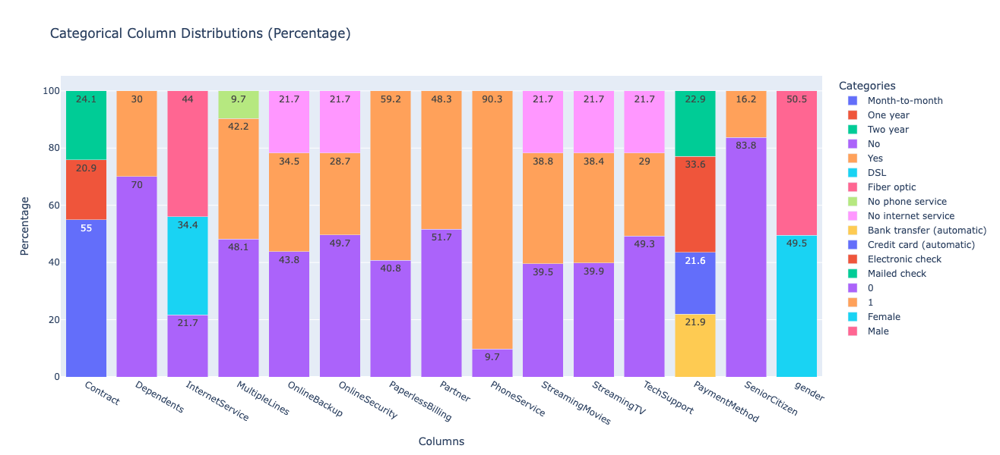

# Telecommunication Data Analysis

## 1. Overview

The Telco dataset analysis project aims to explore customer churn, identifying key factors influencing their decision to leave, and develop predictive models for proactive retention strategies. By analyzing a comprehensive dataset of customer demographics, subscription details, and financial information, the project uncovers critical churn drivers such as short-term contracts, high monthly charges, and lack of bundled services. Advanced preprocessing techniques like feature engineering, data balancing with SMOTE, and categorical encoding were employed to prepare the data for predictive modeling. Multiple machine learning algorithms, including Logistic Regression, Random Forest, and AdaBoost, were tested, with results demonstrating significant improvement in performance when imbalances were addressed. This analysis not only provides actionable insights for reducing churn but also establishes a robust framework for deploying predictive churn models in real-world applications.

## 2. Data Description

The Telco dataset, taken from Kaggle comprises 7,043 customer records from a telecommunications company, detailing information about customer demographics, services, and subscription features. Key attributes include gender, senior citizen status, partner and dependent status, tenure, and service types like phone and internet services. Payment-related features such as monthly charges, total charges, and payment methods are also included, alongside the target variable Churn, indicating whether a customer has discontinued their service. The dataset integrates both categorical and numerical data, with features like InternetService, Contract, and PaymentMethod providing insight into customer behavior. This rich dataset is designed to facilitate an understanding of customer churn, enabling data-driven strategies for customer retention.

## 3. Univariate Analysis

3.1 Analysis of the Categorical Features

  

  Key Points of the Image Above:

  a. InternetService: 56% of customers use fiber-optic services, 34% DSL, and 10% no internet service.

  b. Contract: 55% of customers are on month-to-month contracts, while 19% and 26% are on one- and two-year contracts, respectively.

  c. The subcategories of Internet Service, such as 'OnlineSecurity,' 'OnlineBackup,' 'DeviceProtection,' 'TechSupport,' 'StreamingTV,' and 'StreamingMovies,' each have three unique values: 'Yes,' 'No,' and 'No Internet Service.' The percentage of 'No Internet Service' closely aligns with the percentage of 'No' in the Internet Service category, indicating that 'No' and 'No Internet Service' effectively convey the same information.

3.2 Analysis of the Numerical Features

![Analysis of the Numerical Features](

