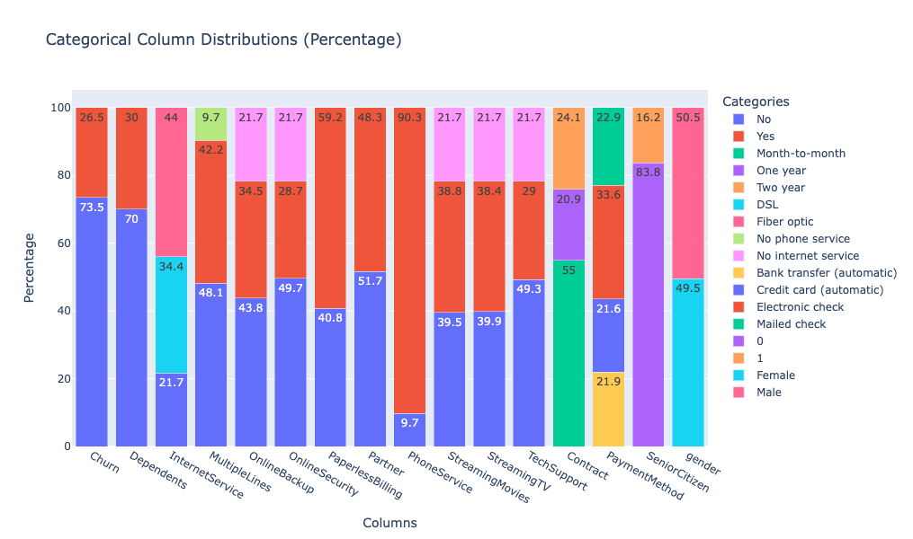
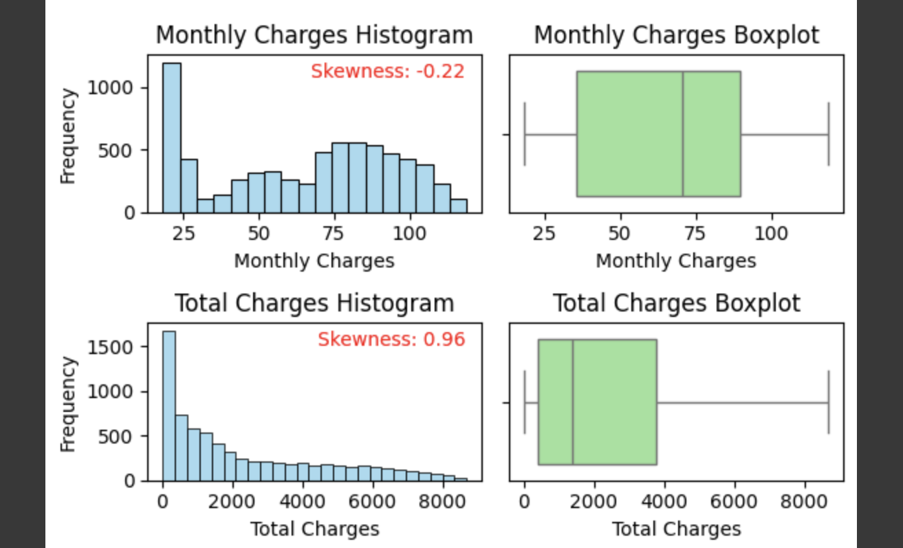
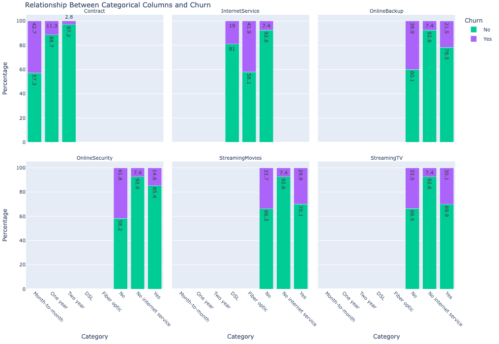
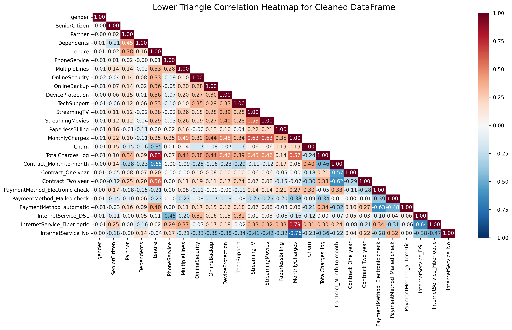
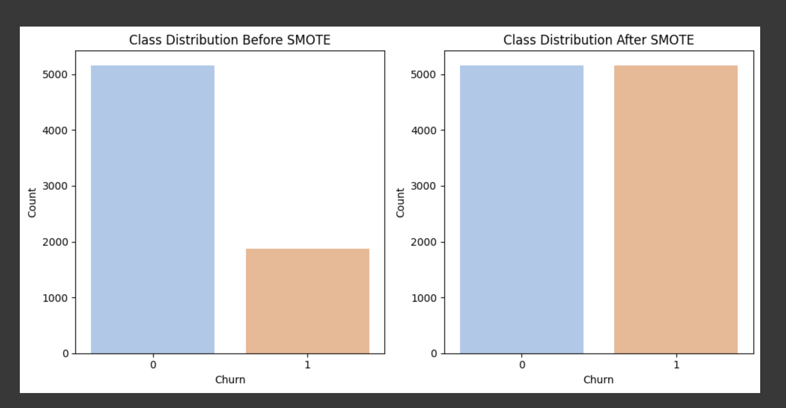
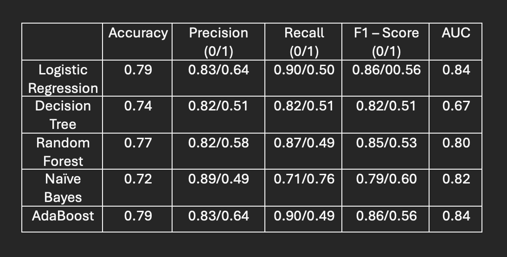
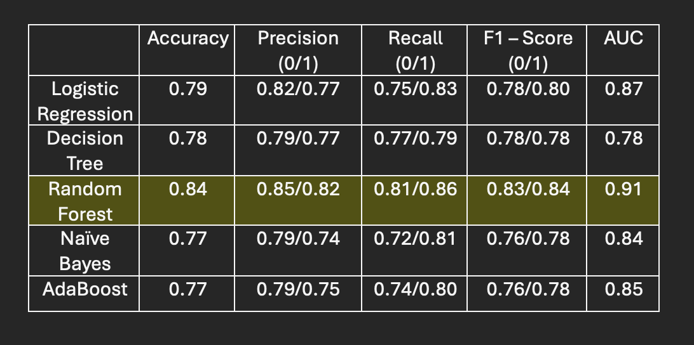
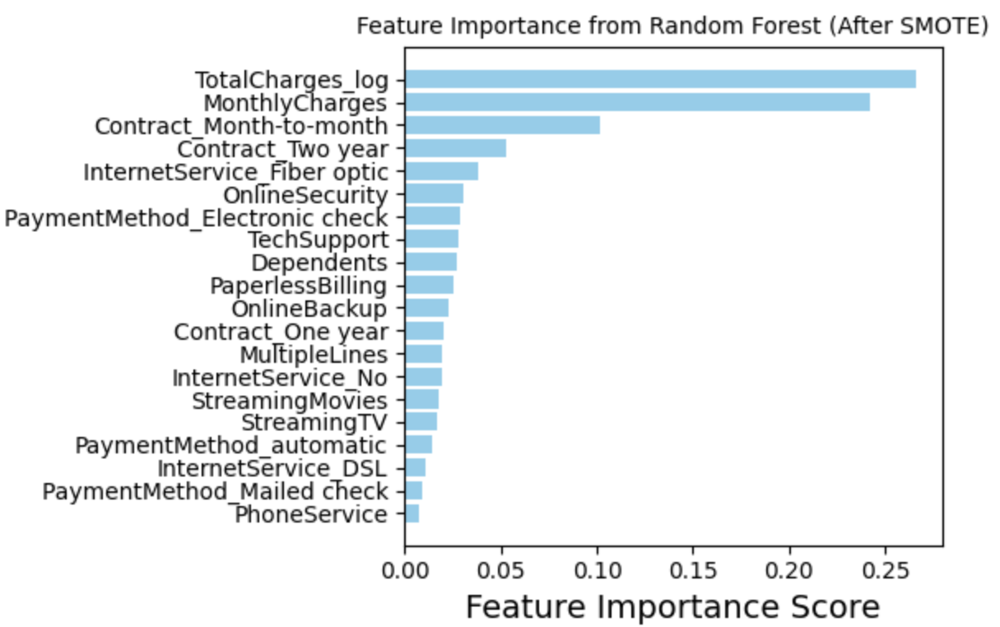

# Telecommunication Data Analysis

## 1. Overview

The Telco dataset analysis project aims to explore customer churn, identifying key factors influencing their decision to leave, and develop predictive models for proactive retention strategies. By analyzing a comprehensive dataset of customer demographics, subscription details, and financial information, the project uncovers critical churn drivers such as short-term contracts, high monthly charges, and lack of bundled services. Advanced preprocessing techniques like feature engineering, data balancing with SMOTE, and categorical encoding were employed to prepare the data for predictive modeling. Multiple machine learning algorithms, including Logistic Regression, Random Forest, and AdaBoost, were tested, with results demonstrating significant improvement in performance when imbalances were addressed. This analysis not only provides actionable insights for reducing churn but also establishes a robust framework for deploying predictive churn models in real-world applications.

## 2. Data Description

The Telco dataset, taken from Kaggle comprises 7,043 customer records from a telecommunications company, detailing information about customer demographics, services, and subscription features. Key attributes include gender, senior citizen status, partner and dependent status, tenure, and service types like phone and internet services. Payment-related features such as monthly charges, total charges, and payment methods are also included, alongside the target variable Churn, indicating whether a customer has discontinued their service. The dataset integrates both categorical and numerical data, with features like InternetService, Contract, and PaymentMethod providing insight into customer behavior. This rich dataset is designed to facilitate an understanding of customer churn, enabling data-driven strategies for customer retention.

## 3. Univariate Analysis

### 3.1 Analysis of the Categorical Features

  

  Key Points of the Image Above:

  a. The Churn variable is highly imbalanced

  b. InternetService: 56% of customers use fiber-optic services, 34% DSL, and 10% no internet service.

  c. Contract: 55% of customers are on month-to-month contracts, while 19% and 26% are on one- and two-year contracts, respectively.

  d. The subcategories of Internet Service, such as 'OnlineSecurity,' 'OnlineBackup,' 'DeviceProtection,' 'TechSupport,' 'StreamingTV,' and 'StreamingMovies,' each have three unique values: 'Yes,' 'No,' and 'No Internet Service.' The percentage of 'No Internet Service' closely aligns with the percentage of 'No' in the Internet Service category, indicating that 'No' and 'No Internet Service' effectively convey the same information.

### 3.2 Analysis of the Numerical Features

Key Points :

a. The skewness of tenure (0.24) and Monthly Charges (-0.22) indicates that these features are well-distributed. However, Total Charges exhibits a positive skew, which is suboptimal for machine learning algorithms. To address this issue, a logarithmic transformation was applied to Total Charges, effectively reducing the skewness to -0.74, thereby improving the data distribution for modeling purposes.

## 4. Bivariate Analysis
### 4.1 Analysis of Categorical Features

Key Points:

a. Customers with two-year contracts have significantly lower churn rates compared to those with month-to-month contracts.

b. Customers using Fiber Optic internet service exhibit higher churn rates than those using DSL, possibly indicating dissatisfaction with the Fiber Optic service.

### 4.1 Analysis of Numerical Features

By analyzing the KDE graphs, we observe the following trends:

  a. Tenure and Churn:

   - Customers with shorter tenures exhibit higher churn rates, indicating a correlation between limited time with the company and an increased likelihood of discontinuing the service.
   - Conversely, as tenure increases, customer retention improves significantly, suggesting that long-standing customers are more loyal to the company.

  b. Monthly Charges and Churn:

   - Lower monthly charges are associated with reduced churn rates, implying that affordability plays a crucial role in customer retention.
   - However, as monthly charges increase, the churn rate also rises, indicating that higher costs may be a significant factor driving customers to discontinue the service.

## 5. Data Preprocessing
### 5.1 Analysis of Missing Values and Outliers
The dataset was rigorously examined for missing values and outliers to ensure data quality and integrity.

  a. Missing Values:
   - A thorough check confirmed that the dataset contained no missing values, eliminating the need for imputation or data cleaning in this aspect.

  b. Outliers:
   - Boxplots were created for numerical features, including tenure, MonthlyCharges, and TotalCharges. While some mild outliers were observed, they were not significant enough to warrant removal or adjustment, as they represented valid variations in customer behavior rather than data anomalies. These outliers were retained to preserve the dataset's integrity and to ensure a realistic model.

### 5.2 Feature Engineering
To streamline the dataset and simplify feature analysis, the following adjustments were made to categorical variables with specific unique values:

  a. Variables with Yes, No, and No Internet:
   - For features like OnlineSecurity, OnlineBackup, DeviceProtection, TechSupport, StreamingTV, and StreamingMovies, the value No Internet was replaced with No. This adjustment ensured consistency in categorical responses and reduced unnecessary complexity.

  b. Phone Service Variable:
   - For the PhoneService feature, the value No Phone Service was replaced with No. Similarly, in the MultipleLines feature, No Phone Service was also standardized to No.

  c. Payment Method Variable:
   - The PaymentMethod feature initially contained four categories: 'Electronic check', 'Mailed check', 'Bank transfer (automatic)', and 'Credit card (automatic)'. During preprocessing, this feature was simplified into three categories: 'automatic', 'mailed check', and 'electronic'. The 'automatic' category combines 'Bank transfer (automatic)' and 'Credit card (automatic)', as these represent similar automated payment methods. The 'Electronic check' category was retained separately due to its notably high churn rate, making it critical for deeper analysis to understand its impact on customer behavior.
     
### 5.3 Encoding
The dataset contained both categorical and binary features that required encoding to prepare the data for machine learning algorithms. The following steps were applied:

  a. One-hot-encoding was applied to Contract, Payment Method and Internet Services
  
  b. Binary Encoding was applied to the rest of the features to turn No into 0 and Yes into 1

### 5.3 Standardization
StandardScaler applied to numerical features (tenure, MonthlyCharges, TotalCharges_log).

### 5.3 Correlation Heatmap 

Key Points:

  a. Strong Postive Correlations
  
   - TotalCharges_log and tenure: Correlation of 0.83 suggests high dependency.
     
   - InternetService_Fiber optic and MonthlyCharges: Correlation of 0.79 indicates customers with fiber optics tend to have higher charges.

  b.  Strong Negative Correlations:

   - Strong positive correlation with Contract_Month-to-month (0.35): Month-to-month contracts are more likely to churn.

   - Negative correlation with Contract_Two year (-0.29): Customers on two-year contracts are less likely to churn.

   c. Multicolinearity :

  - There is a strong correlation between TotalCharges_log and tenure. Therefore, the tenure variable was removed from the dataset to ensure more accurate results in the logistic regression analysis.

### 5.3 Handling Imbalanced Dataset

Applied SMOTE (Synthetic Minority Oversampling Technique) to overcome the imbalance dataset. This technique addresses class imbalance by generating synthetic samples for the minority class (Churn = 1), ensuring the dataset has a more balanced distribution of classes, which helps improve model performance and generalization for predicting churn as shown by the image below.

## 5. Model Predictions and Significant Features

### 5.1 Model Description

Trained five machine learning models—Logistic Regression, Decision Tree, Random Forest, Naive Bayes, and AdaBoost—using an 80-20 train-test split. Each model was evaluated in two scenarios: with the original imbalanced dataset and with SMOTE-applied data to balance classes. This aimed to assess the impact of balancing on accuracy, recall, precision (for the minority class), F1-Score, and AUC. 

### 5.1 Results without applying SMOTE

### 5.2 Results after applying SMOTE

### 5.2 Results

SMOTE proved highly effective in improving minority class recall and F1-Scores across all models by addressing class imbalance, with the most significant improvements observed in Random Forest and Logistic Regression. Random Forest emerged as the best performer with SMOTE, achieving the highest accuracy (84%), recall (86%), and AUC (91%), while Logistic Regression demonstrated consistent performance, making it suitable for scenarios requiring interpretability. Naive Bayes showed minimal improvement due to its simplicity and feature independence assumptions. While SMOTE enhanced recall and F1-Scores, it slightly reduced precision for the majority class (Churn = 0), leading to more false positives—a trade-off that may be acceptable to minimize missed churn cases. Improved recall facilitates identifying more at-risk customers, making Random Forest with SMOTE ideal for churn detection, while Logistic Regression offers a balanced alternative.

### 5.3 Significant Features

Key Features:

  a. TotalCharges_log:
  
   - Customers with higher cumulative charges are strongly correlated with churn, possibly indicating dissatisfaction due to billing inconsistencies or high total costs.

  b.  MonthlyCharges:

   - Higher monthly charges increase churn risk, suggesting pricing sensitivity among customers.

  c. Contract_Month-to-month:
  
   - Month-to-month customers are at a significantly higher risk of churn due to lack of commitment or flexibility to leave at any time.

  d.  InternetService_Fiber optic:

   - Customers with fiber optic services show higher churn rates, likely due to pricing or unmet service quality expectations.

  e. OnlineSecurity:
  
   - Customers without online security are more likely to churn, indicating that value-added services play an important role in customer retention.

  b.  PaymentMethod_Electronic check:

   - Customers using electronic checks are more likely to churn, possibly due to perceived inconvenience compared to automatic payments.

